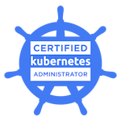
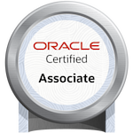

### Hi there 👋

Welcome to my GitHub page! 

### About me

Specialized in software architecture applied to orchestrated and containerized environments, I'm working since several years in the domain of healthcare and research.

Thanks to my current and past experiences I had the opportunity to work on :
- :cloud: Managing and accompanying partners and third-party healthcare solutions for deployment in cloud based environments 
- :hospital: API implementations of healthcare standards (DICOM, FHIR) 
- :rocket: Integration, development and deployment of healthcare solution in cloud environment (Jupyter Hub, Medical Image Viewers, Genomic Tools...)
- :sailboat: Administration and management of Kubernetes clusters
- :light_rail: Development, deployment and administration of DEV/SEC/OPS tools (ArgoCD, Vault, Falco, CI/CD pipelines and many more!)
- :closed_lock_with_key: Administration and integration of OIDC and SAML security flows on web applications and APIs

### My badges

<!--
**kzgrzendek/kzgrzendek** is a ✨ _special_ ✨ repository because its `README.md` (this file) appears on your GitHub profile.

Here are some ideas to get you started:

- 🔭 I’m currently working on ...
- 🌱 I’m currently learning ...
- 👯 I’m looking to collaborate on ...
- 🤔 I’m looking for help with ...
- 💬 Ask me about ...
- 📫 How to reach me: ...
- 😄 Pronouns: ...
- ⚡ Fun fact: ...
-->
